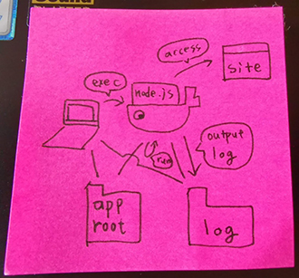

# Docker で Node.js のバッチを実行する

## 構成



## 実行手順

1. clone してね。
2. node.js のアプリケーションを直下に app というディレクトリ名で置いてね。

```SHELL
# git で管理しているアプリの場合
$ git clone ${application_url} ./app

# 作る場合
$ mkdir ./app && cd ./app && npm init
$ vim index.js
```

3. Docker Container を起動してね。

```SHELL
$ docker build . -t=node/local
$ docker run --name="node" -ditv $pwd/app:/app -v $pwd/logs:/var/log/app node/local /bin/bash
```

4. 依存するものをインストールしてね。

```SHELL
$ docker exec node npm install
```

5. 実行してね。

```SHELL
$ docker exec node npm start
```

## こんな時は

### ログインして作業したい！

```SHELL
$ docker run --name="node" -ditv $pwd/app:/app -v $pwd/logs:/var/log/app node/local /bin/bash
```
